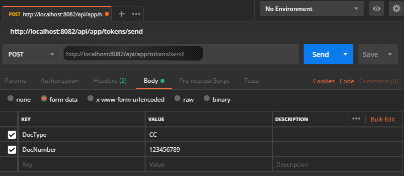

# Solicitud de envío de token transaccional

Procesa la solicitud de envío de un token transaccional (generalmente el token se entregará al usuario a través de un mensaje SMS).

| Endpoint                             | Verbo | Requiere autenticación |
| ------------------------------------ | :---: | :--------------------: |
| http://localhost/api/app/tokens/send | POST  |         [ Si ]         |

> [^Segmentos de URL]: La información entre corchetes en la URL se denomina segmentos de URL y aplican solo para algunas operaciones. Cuando aparezcan en un ejemplo, deben ser reemplazados por sus valores correspondientes omitiendo los corchetes. Por ejemplo, sin en la URL de ejemplo apareciera http://localhost/api/operation/value/{value}, para establecer el valor de  `value` en la solicitud a la cadena `abc`, la URL final se vería de la siguiente forma: http://localhost/api/operation/value/abc 

## Datos de la solicitud (body)

```json
{
  "DocType": "CC",
  "DocNumber": "123456789",  
  "Metadata" : "RANDOM_DATA_BY_ACQUIRER"
}
```

### Valores de la solicitud

Campo | Tipo de dato | Descripción | Requerido
:---: | :--------: | ------------ | :-----:
DocType | string | [Tipo de documento](Inquiries-CustomerAccounts.md#DocTypes) del usuario para el que se solicita la generación de un token transaccional. | [ Si ] 
DocNumber | string | Número de documento del usuario para el que se solicita la generación de un token transaccional. | [ Si ] 
Metadata | string | Metadatos asociados personalizados para el [TPS](Tokenization/#tps). | [Opcional] 

## Datos de la respuesta

> Si al procesar la respuesta del servicio está utilizando un serializador que distinga mayúsculas y minúsculas, tenga en cuenta que Aspen genera todas sus respuestas utilizando el formato conocido como [LowerCamelCase](https://en.wikipedia.org/wiki/Camel_case)

Esta operación no retorna información adicional al código de estado de HTTP de acuerdo con la especificación [RFC 2616](https://www.w3.org/Protocols/rfc2616/rfc2616-sec10.html). Si la respuesta no es `HttpStatus` 200, en el campo  `ReasonPhrase` de la respuesta encontrará un mensaje que describe de forma detallada el resultado de la operación.

### Valores de respuesta más utilizados

HttpStatus | Tipo | Descripción
:---: | :--------: | ------------
200 | int | El token se envió satisfactoriamente al usuario. 
503 | int | No fue posible entregar el token transaccional al usuario. No se encontró en el sistema o no se tiene información para la entrega. 

## Ejemplo en Postman



## Información relacionada

- [Generar un token de autenticación](Generate-Token.md)

- [Registro de aplicaciones](App_Register.md)

- [Mensajes de respuesta](Responses.md)

- [Tipos de documentos reconocidos](Inquiries-CustomerAccounts.md#DocTypes)

  

